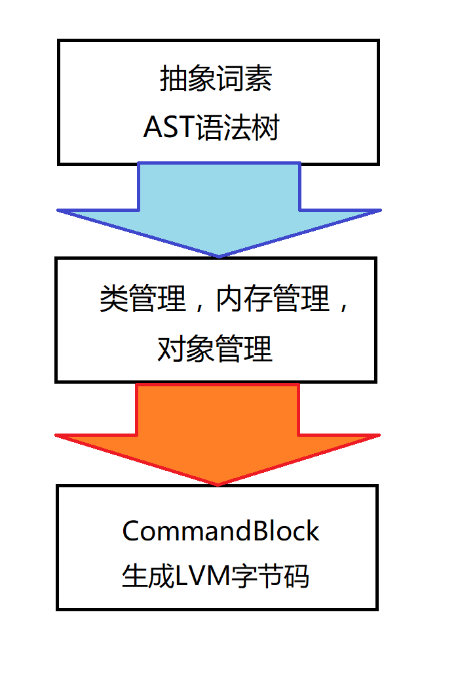

# LML架构简介

## 架构的层次设计
&emsp;&emsp;LML的架构主要分为三层：  
  
* 第一层为抽象顶层。可以解析用户提供的合法的**AST语法树**。
* 第二层为中间层。为管理各种**资源**（比如类和对象）提供有效的工具。
* 第三层为底层。直接用于链接**CommandBlock**，生成**LVM字节码**。  

## 层次的具体功能

### 抽象顶层

&emsp;&emsp;先简单的介绍一下顶层的设计。由**LML**框架提供词素类型。  

#### 词素
&emsp;&emsp;这里的**词素**是我自己定义的概念。只是指一个单词字符串，比如说`"shit"`,`1`,`run`这些就可以定义为一个个的词素。
其中`"shit"`的类型就为字符串，`1`就为一个数字，`run`则可以是一个对象或关键字。那么，**记号**与**词素**有什么不同呢？
在**LML**中，AST语法树接受词素为基本单元，一个词素明确地定义了一个字符串的类型又剔除了一些无用的符号（比如左右括号）。
而记号仅仅是由对输入的字符串进行简要的拆分而形成的。至于记号到词素的转化，可由用户自行实现。

#### AST语法树
&emsp;&emsp;**语法树**是由一个个语法节点构成的树形结构。重点在于其基本的语法节点。
在**LML**中，语法节点是由一系列的**词素**及一个类型说明构成的。一般来说，第一个词素就是要执行的可执行对象（如函数或关键字），其余的词素均视为其参数。
然而，在这些参数中也有分类。如果是**字面值**，则直接使用。但如果是变量（函数调用结果也算是变量）则会继续向下生成一个子节点，在解析时，也会继续递归下去。
语法节点的类型目前分为：**符号**，**变量**，**字面字符串**，**字面整数**，**字面浮点数**，**关键字**，**可调用对象**等。
